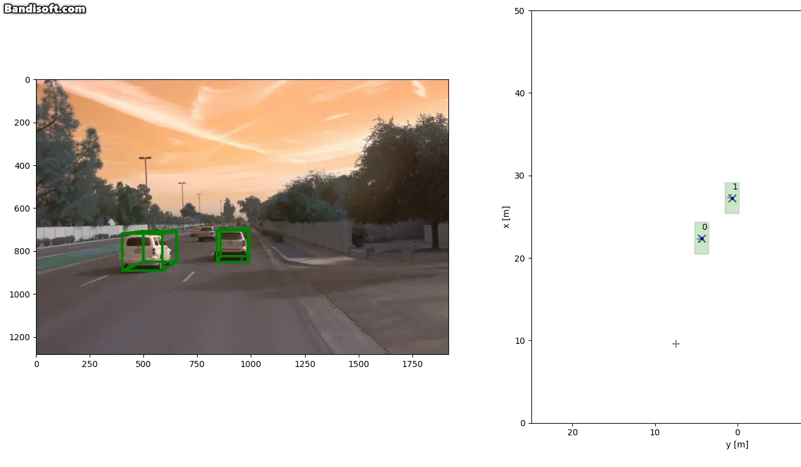

# SDCND : Sensor Fusion and Tracking
This is the project for the second course in the  [Udacity Self-Driving Car Engineer Nanodegree Program](https://www.udacity.com/course/c-plus-plus-nanodegree--nd213) : Sensor Fusion and Tracking. 

*Acknowledgements*

Any copyright of skeleton code belongs to Udacity. Refer to the License at the end of page.


## Pt1. Deep Detection Network on Lidar Data
In this project, I use lidar and camera data from the Waymo Open Dataset, and detect objects in the 3D point clouds using a pretrained complex-yolo implementation.


## Pt2. Multiple Target Tracking(Association+Track Management)
I used the extended Kalman filter to track vehicles over time. Data association and track management are implemented as well.

The following diagram contains an outline of the data flow and of the individual steps that make up the algorithm. 


Run Example:

On the right, a vehicle approaching on the first lane is given its track, which appears on the right. Initially, the track is red(initialized), and as more data is associated to the vehicle, the track is verified, and appears as green.




### Package Requirements
All dependencies required for the project have been listed in the file `requirements.txt`. 
```
pip3 install -r requirements.txt
```


### Waymo Open Dataset Reader
`tools/waymo_reader/README.md`. 

### Waymo Open Dataset Files
This project makes use of three different sequences to illustrate the concepts of object detection and tracking. These are: 
- Sequence 1 : `training_segment-1005081002024129653_5313_150_5333_150_with_camera_labels.tfrecord`
- Sequence 2 : `training_segment-10072231702153043603_5725_000_5745_000_with_camera_labels.tfrecord`
- Sequence 3 : `training_segment-10963653239323173269_1924_000_1944_000_with_camera_labels.tfrecord`

The sequences listed above can be found in the folder "training". Please download them and put the `tfrecord`-files into the `dataset` folder of this project.


### Pre-Trained Models
The object detection methods used in this project use pre-trained models which have been provided by the original authors. They can be downloaded [here](https://drive.google.com/file/d/1Pqx7sShlqKSGmvshTYbNDcUEYyZwfn3A/view?usp=sharing) (darknet) and [here](https://drive.google.com/file/d/1RcEfUIF1pzDZco8PJkZ10OL-wLL2usEj/view?usp=sharing) (fpn_resnet). Once downloaded, please copy the model files into the paths `/tools/objdet_models/darknet/pretrained` and `/tools/objdet_models/fpn_resnet/pretrained` respectively.


- `exec_tracking` : controls the execution of the object tracking algorithm

- `exec_visualization` : controls the visualization of results
  - `show_range_image` displays two LiDAR range image channels (range and intensity)
  - `show_labels_in_image` projects ground-truth boxes into the front camera image
  - `show_objects_and_labels_in_bev` projects detected objects and label boxes into the birds-eye view
  - `show_objects_in_bev_labels_in_camera` displays a stacked view with labels inside the camera image on top and the birds-eye view with detected objects on the bottom
  - `show_tracks` displays the tracking results
  - `show_detection_performance` displays the performance evaluation based on all detected 
  - `make_tracking_movie` renders an output movie of the object tracking results

## License
[License](LICENSE.md)
